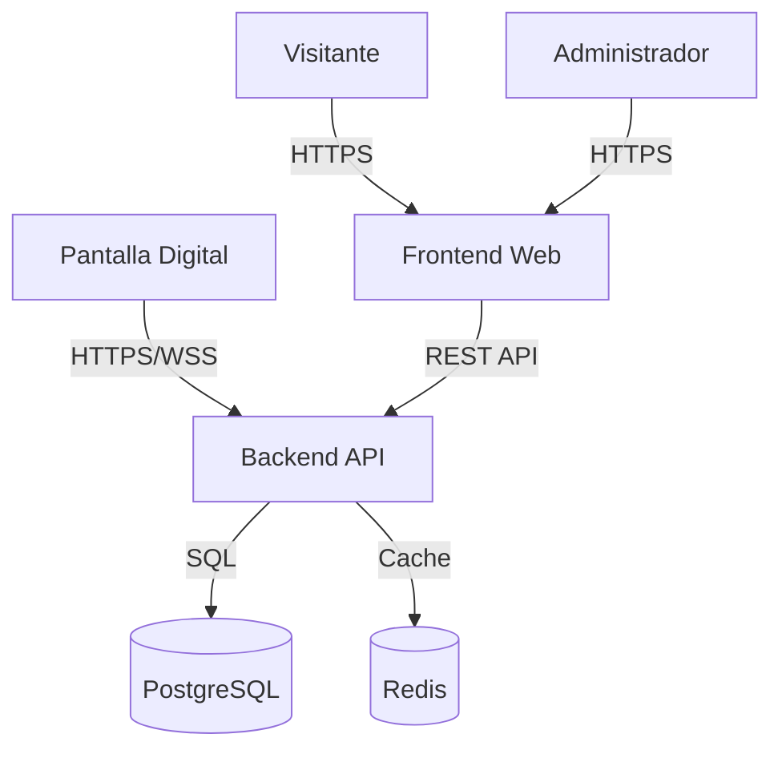
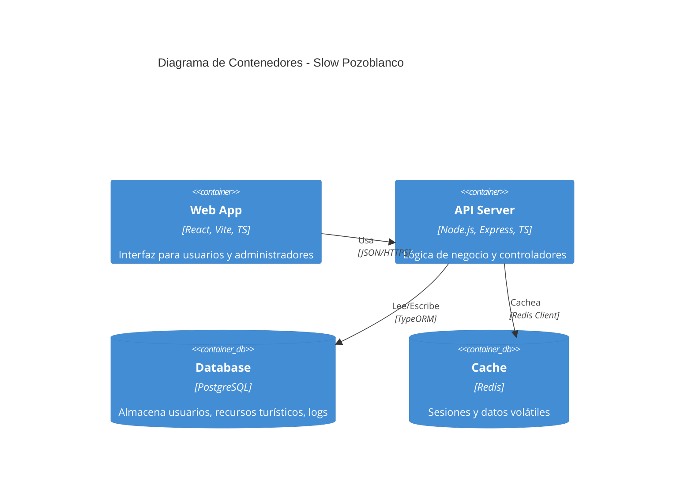

# Arquitectura del Sistema

## Diagrama de Contexto

El sistema Slow Pozoblanco interactúa con varios actores: Visitantes (App móvil/Web), Administradores (Panel Web), y Dispositivos IoT (Pantallas digitales).

## Diagrama de Contenedores

Detalle de los componentes principales del software.

## Seguridad y Autenticación

- **JWT (JSON Web Tokens)**: Se utilizan para autenticar las peticiones de la API.
- **RBAC (Role-Based Access Control)**:
  - `ADMIN`: Acceso total.
  - `USER`: Acceso limitado a gestión propia.
  - `ROBOT`: Rol para dispositivos automatizados.

## Logging

Se utiliza **Winston** para el registro de logs estructurados en el backend. Los logs se rotan diariamente y se almacenan localmente en `backend/logs/`.
